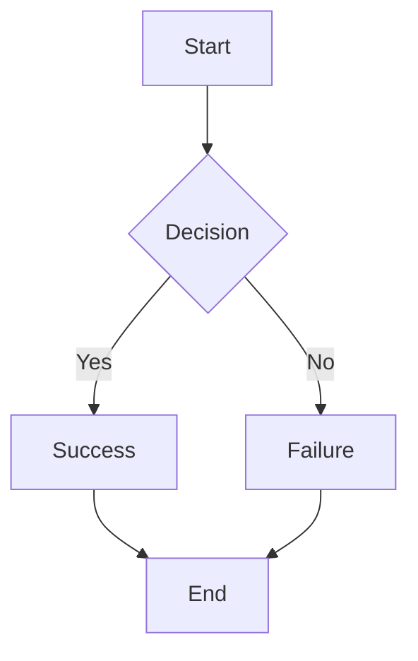
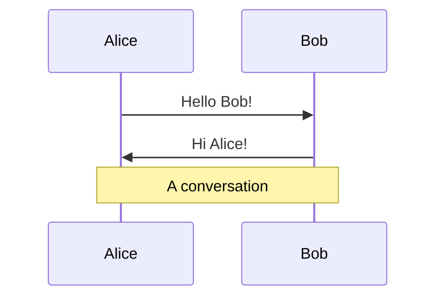
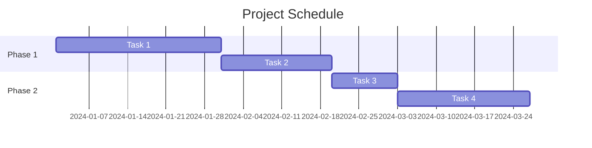
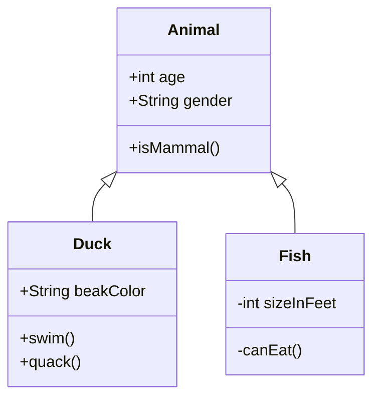
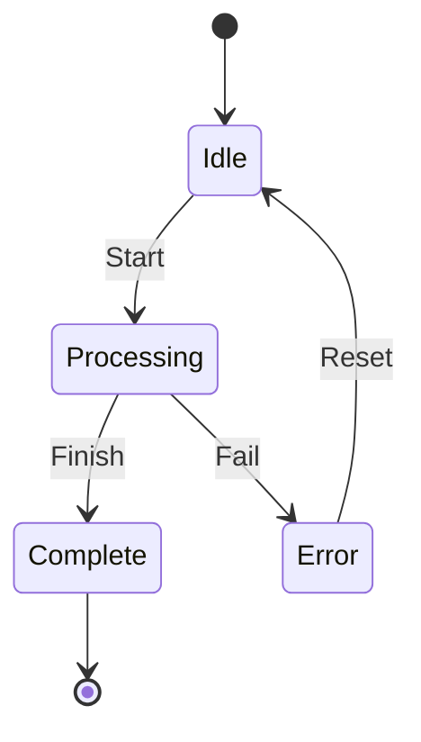
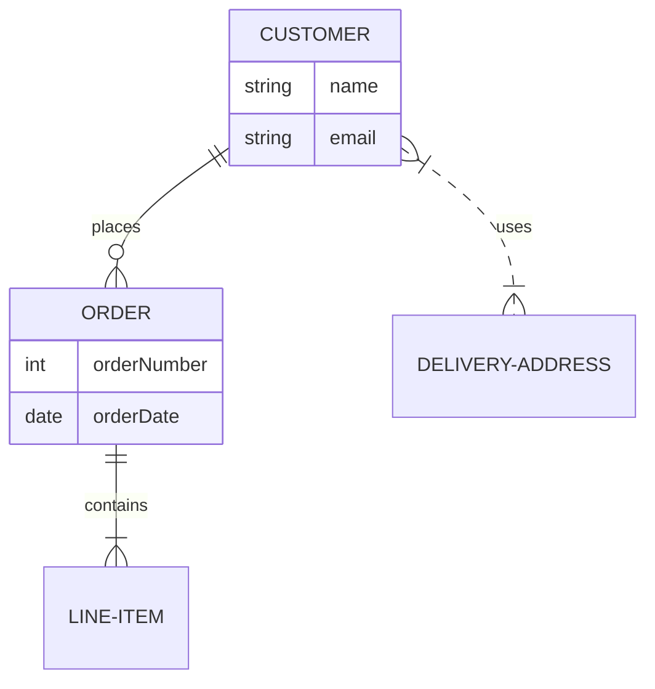
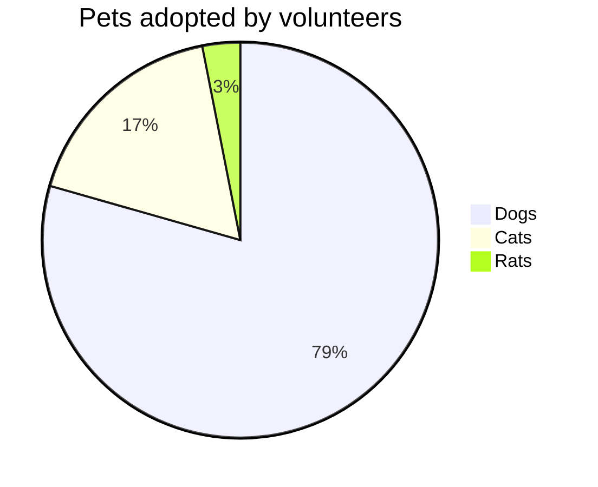
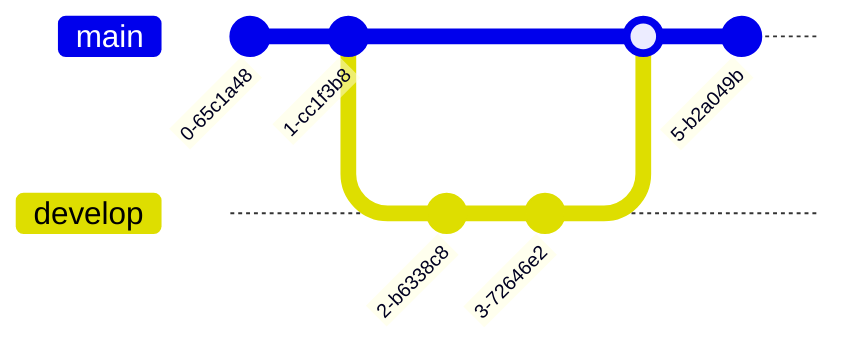
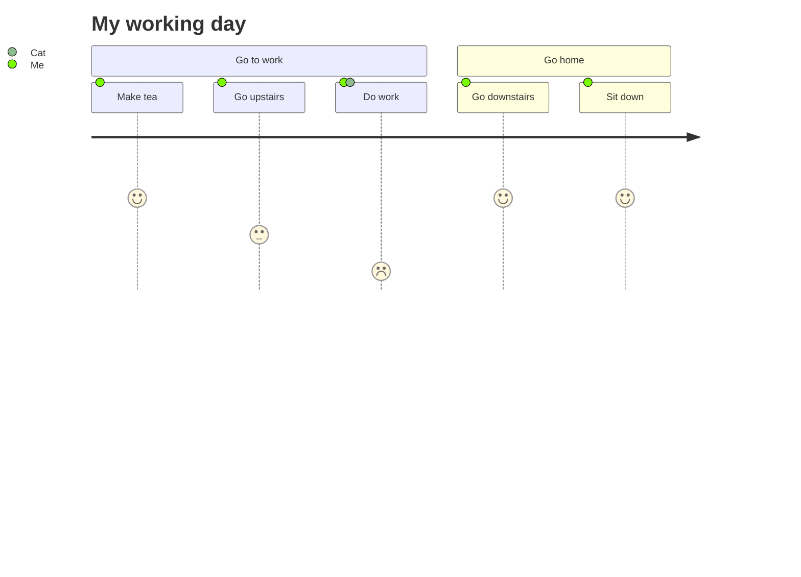

# Mermaid Diagrams Quick Reference

This guide provides quick examples of the most common Mermaid diagram types you can use in your blog posts.

## Basic Syntax

To add a Mermaid diagram to your blog post, use a code block with `mermaid` as the language:

    ```mermaid
    graph TD
        A[Start] --> B[End]
    ```

---

## Flowchart

### Basic Flowchart


### Node Shapes
- `A[Rectangle]` - Rectangle
- `B(Rounded)` - Rounded edges
- `C([Stadium])` - Stadium shape
- `D[[Subroutine]]` - Subroutine
- `E[(Database)]` - Database
- `F((Circle))` - Circle
- `G>Flag]` - Flag
- `H{Diamond}` - Diamond/Decision
- `I{{Hexagon}}` - Hexagon

---

## Sequence Diagram



### Arrow Types
- `->` Solid line without arrow
- `-->` Dotted line without arrow
- `->>` Solid line with arrowhead
- `-->>` Dotted line with arrowhead
- `-x` Solid line with cross
- `--x` Dotted line with cross

---

## Gantt Chart



---

## Class Diagram



### Relationship Types
- `<|--` Inheritance
- `*--` Composition
- `o--` Aggregation
- `-->` Association
- `--` Link (Solid)
- `..>` Dependency
- `..|>` Realization
- `..` Link (Dashed)

---

## State Diagram



---

## Entity Relationship Diagram



### Relationship Cardinality
- `|o` Zero or one
- `||` Exactly one
- `}o` Zero or more
- `}|` One or more

---

## Pie Chart



---

## Git Graph



---

## User Journey



---

## Tips

1. **Test your diagrams** at [Mermaid Live Editor](https://mermaid.live/)
2. **Keep diagrams simple** - Complex diagrams are hard to read
3. **Use meaningful names** - Make node and relationship names descriptive
4. **Add notes** - Use `Note` to add explanations
5. **Check rendering** - Always preview locally before publishing

## Resources

- [Mermaid Official Documentation](https://mermaid.js.org/)
- [Mermaid Syntax Reference](https://mermaid.js.org/intro/syntax-reference.html)
- [Mermaid Live Editor](https://mermaid.live/)
- [Mermaid GitHub](https://github.com/mermaid-js/mermaid)

---

**Note:** All these diagram types are fully supported in your blog posts!
