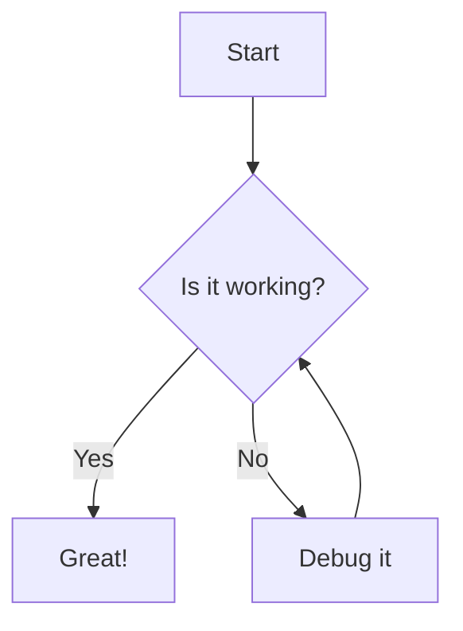

# Cristian Mayo's GitHub Page

A modern static site built with [Eleventy (11ty)](https://www.11ty.dev/), featuring a blog, GitHub repository integration, and responsive design.

## **Features**

- ?? **Blog** - Write blog posts in Markdown with frontmatter support
- ?? **GitHub Integration** - Automatically fetch and display repositories from GitHub API
- ?? **Consistent Design** - Dark-themed UI with orange accents
- ?? **Responsive** - Mobile-friendly layout
- ?? **Fast** - Static site generation for optimal performance
- ?? **Auto-cleanup** - Automated build process cleans output directory


---

## **Get Started**

### Prerequisites

- Node.js (v14 or higher)
- npm or yarn

### Local Development Setup

1. **Clone the repository**
   ```bash
   git clone https://github.com/cristianmayo/cristianmayo.github.io.git
   cd cristianmayo.github.io
   ```

2. **Install dependencies**
   ```bash
   npm install
   ```

3. **Build SCSS styles**
   ```bash
   npx gulp build
   ```

4. **Start development server**
   ```bash
   npm start
   ```
   
   The site will be available at `http://localhost:8080`

5. **Build for production**
   ```bash
   npm run build
   ```
   
   Output will be in the `docs/` directory

---

## **Adding a New Blog Post**

### Step 1: Create a Markdown File

Create a new file in the `src/blog/` directory with the following naming convention:

```
YYYYMMDD_your-post-slug.md
```

**Example:** `20240122_my-awesome-post.md`

### Step 2: Add Frontmatter

At the top of your markdown file, add frontmatter with the following fields:

```markdown
---
title: Your Post Title
date: 2024-01-22
category: Technology
tags: [eleventy, javascript, web-development]
excerpt: A brief description of your post that will appear in the blog index.
---

# Your Post Content Starts Here

Write your blog post content using Markdown...
```

### Step 3: Write Your Content

Use standard Markdown syntax to write your post:

```markdown
## Headings

Use ## for main sections, ### for subsections

## Code Blocks

\`\`\`javascript
const example = "You can include code examples";
console.log(example);
\`\`\`

## Lists

- Bullet point 1
- Bullet point 2

1. Numbered item 1
2. Numbered item 2

## Links and Images

[Link text](https://example.com)


## Blockquotes

> This is a quote or important note

## Mermaid Diagrams

Create flowcharts, sequence diagrams, and more:

\`\`\`mermaid
graph TD
    A[Start] --> B{Decision}
    B -->|Yes| C[Success]
    B -->|No| D[Try Again]
\`\`\`

Supported diagram types:
- Flowcharts
- Sequence diagrams
- Gantt charts
- Class diagrams
- State diagrams
- Entity relationship diagrams
- Pie charts

See the [Mermaid documentation](https://mermaid.js.org/) for syntax details.
```

### Step 4: Build and Test

1. **Compile SCSS (if you made style changes)**
   ```bash
   npx gulp build
   ```

2. **Build the site**
   ```bash
   npm run build
   ```

3. **Start the dev server to preview**
   ```bash
   npm start
   ```

4. **View your post**
   - Blog index: `http://localhost:8080/blog`
   - Your post: `http://localhost:8080/blog/YYYY/MM/DD/your-post-slug/`


### Frontmatter Reference

| Field | Required | Type | Description |
|-------|----------|------|-------------|
| `title` | ? Yes | String | The title of your blog post |
| `date` | ? Yes | Date (YYYY-MM-DD) | Publication date (used for URL and sorting) |
| `category` | ? Optional | String | Post category (e.g., "Technology", "Web Development") |
| `tags` | ? Optional | Array | Tags for the post (e.g., `[javascript, tutorial]`) |
| `excerpt` | ? Optional | String | Brief description (auto-generated if not provided) |
| `draft` | ? Optional | Boolean | Set to `true` to exclude from published posts |

### URL Structure

Posts are automatically published with the following URL pattern:

```
/blog/YYYY/MM/DD/title-slug/
```

**Example:**
- File: `20240122_getting-started-with-eleventy.md`
- Title: `Getting Started with Eleventy`
- URL: `/blog/2024/01/22/getting-started-with-eleventy/`

**Note:** URLs are now generated from the post title (slugified) instead of the filename.

### Tips

- ? **Use descriptive slugs** - Make filenames URL-friendly
- ? **Add excerpts** - Provide custom excerpts for better control
- ? **Organize with categories** - Group related posts
- ? **Use tags liberally** - Help readers find related content
- ? **Test locally first** - Always preview before committing
- ? **Keep images in** `/src/assets/img/` - Reference with `/assets/img/filename.jpg`
- ? **Use Mermaid diagrams** - See [Mermaid Guide](MERMAID_GUIDE.md) for syntax examples


### Using Mermaid Diagrams

This blog has full support for Mermaid diagrams! You can create:

- ?? Flowcharts and process diagrams
- ?? Sequence diagrams
- ?? Gantt charts
- ??? Class diagrams
- ?? State diagrams
- ?? Entity relationship diagrams
- ?? Pie charts
- And more!

**Quick Example:**
````markdown

````

?? **Full Guide:** See [MERMAID_GUIDE.md](MERMAID_GUIDE.md) for comprehensive examples and syntax reference.

?? **Theme:** Mermaid diagrams are automatically styled to match the site's dark theme with orange accents.


---

## **Project Structure**

```
cristianmayo.github.io/
??? src/
?   ??? _data/              # Data files
?   ?   ??? profile.json    # Your profile information
?   ?   ??? githubRepositories.js  # GitHub API integration
?   ??? _includes/          # Templates and partials
?   ?   ??? _base.njk       # Base layout
?   ?   ??? _base-nav.njk   # Navigation component
?   ?   ??? blog-post.njk   # Blog post template
?   ?   ??? contents/       # Content components
?   ??? assets/
?   ?   ??? css/            # SCSS files
?   ?   ??? img/            # Images
?   ??? blog/               # Blog posts (Markdown)
?   ?   ??? blog.json       # Blog configuration
?   ?   ??? index.njk       # Blog index page
?   ?   ??? *.md            # Blog post files
?   ??? index.njk           # Home page
?   ??? repositories.njk    # Repositories page
??? docs/                   # Generated output (auto-cleaned on build)
??? .eleventy.js            # Eleventy configuration
??? gulpfile.js             # Gulp tasks for SCSS
??? package.json            # Dependencies and scripts
```


---

## **NPM Scripts**

| Script | Command | Description |
|--------|---------|-------------|
| `npm start` | `eleventy --serve` | Start development server with live reload |
| `npm run build` | `eleventy` | Build site for production |
| `npm run clean` | Clean script | Remove docs directory |
| `npm run dev` | Dev mode | Run Eleventy + Gulp watch concurrently |

---

## **Customization**

### Update Profile Information

Edit `src/_data/profile.json`:

```json
{
    "name": "Your Name",
    "githubUsername": "your-github-username"
}
```

### Modify Colors

Edit CSS variables in `src/assets/css/_variables.scss`:

```scss
:root {
    --bg-primary: #ff4500;      // Primary orange
    --bg-secondary: #ff6e02;    // Secondary orange
    --text-primary: #ff6e02;    // Primary text color
    // ... more variables
}
```

### Rebuild Styles

After modifying SCSS files:

```bash
npx gulp build
npm run build
```

---

## **GitHub Repository Integration**

The site automatically fetches your GitHub repositories using the GitHub API. Data is cached for 1 hour to improve performance.

**Configuration:** `src/_data/githubRepositories.js`

The integration displays:
- Repository name and description
- Primary language
- Star and fork counts
- Topics/tags
- Homepage URL
- Archived status

---

## **Deployment**

### GitHub Pages

1. **Build the site**
   ```bash
   npm run build
   ```

2. **Commit changes**
   ```bash
   git add .
   git commit -m "Update blog post"
   git push origin main
   ```

3. **Configure GitHub Pages**
   - Go to Settings > Pages
   - Source: Deploy from a branch
   - Branch: `main` (or your default branch)
   - Folder: `/docs`

---

## **Technologies Used**

- [Eleventy](https://www.11ty.dev/) - Static site generator
- [Nunjucks](https://mozilla.github.io/nunjucks/) - Templating engine
- [Mermaid](https://mermaid.js.org/) - Diagram and flowchart generation
- [Sass/SCSS](https://sass-lang.com/) - CSS preprocessing
- [Gulp](https://gulpjs.com/) - Task automation
- [Markdown-it](https://github.com/markdown-it/markdown-it) - Markdown parser
- [Luxon](https://moment.github.io/luxon/) - Date handling
- [Font Awesome](https://fontawesome.com/) - Icons
- [Eleventy Fetch](https://www.11ty.dev/docs/plugins/fetch/) - API data caching

---


---

## **Contributing**

Contributions are welcome! Please feel free to submit a Pull Request.

1. Fork the repository
2. Create your feature branch (`git checkout -b feature/AmazingFeature`)
3. Commit your changes (`git commit -m 'Add some AmazingFeature'`)
4. Push to the branch (`git push origin feature/AmazingFeature`)
5. Open a Pull Request

---

## **License**

This project is licensed under the MIT License.

---

## **Contact**

**Cristian Mayo**
- GitHub: [@cristianmayo](https://github.com/cristianmayo)
- Website: [cristianmayo.github.io](https://cristianmayo.github.io)

---

**Made with ?? using Eleventy**


