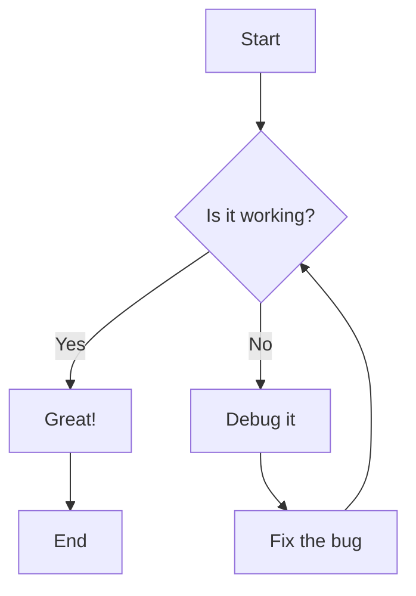
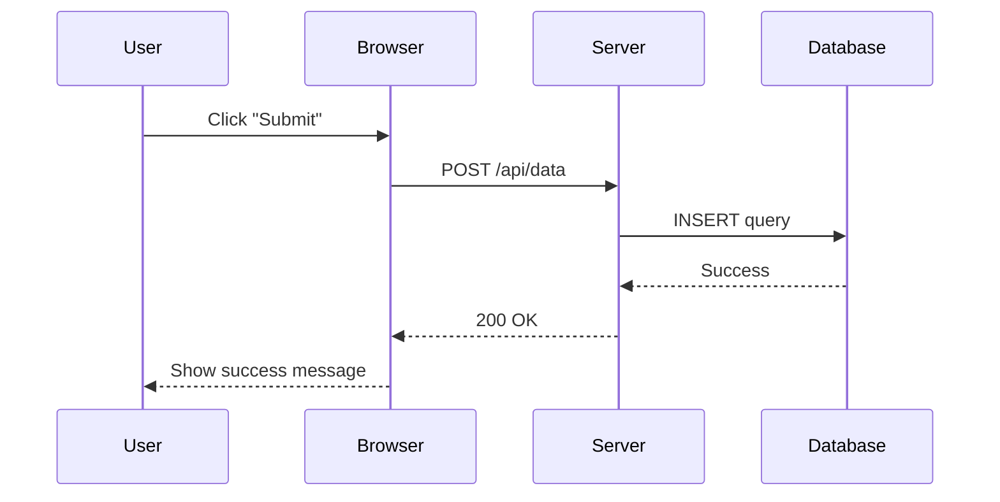
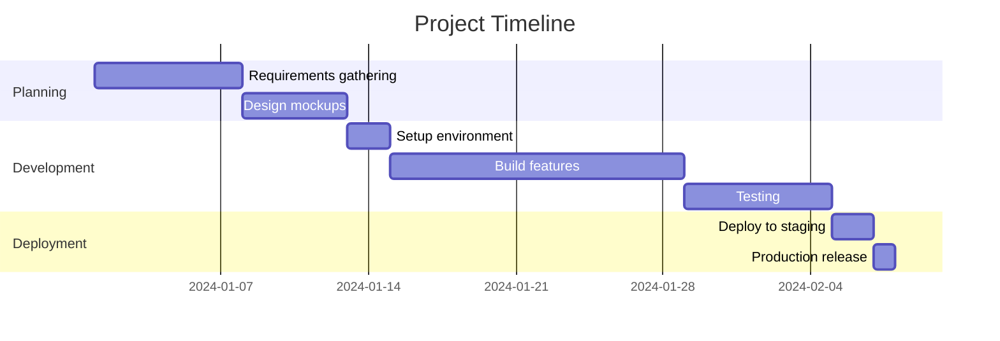
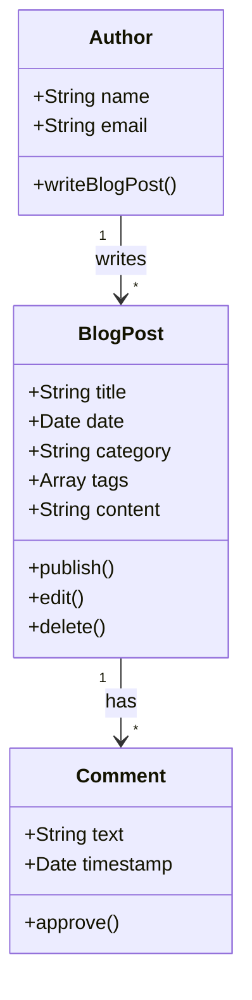
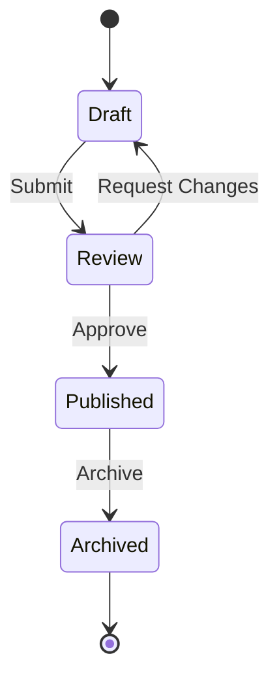
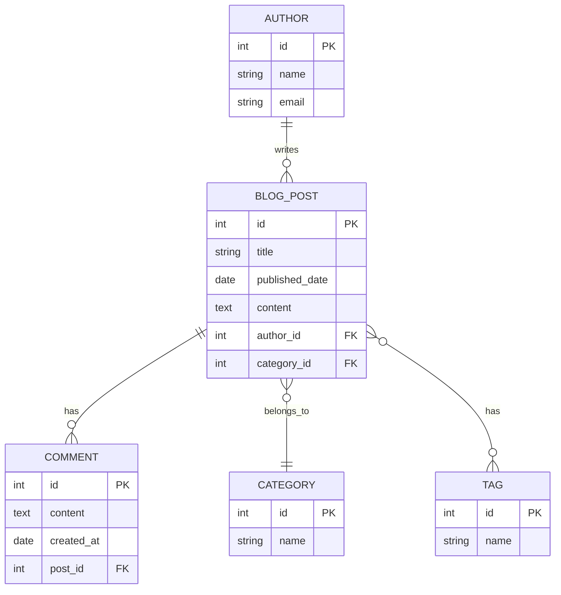
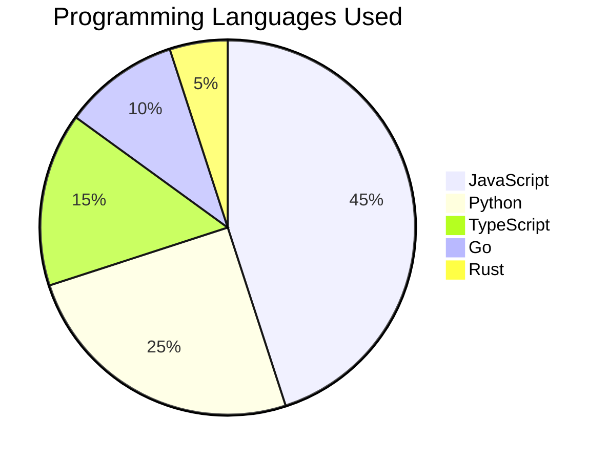

# Visualizing Ideas with Mermaid Diagrams

Mermaid is a powerful tool that lets you create diagrams and visualizations using simple text descriptions. This blog supports Mermaid natively, allowing you to include various types of diagrams directly in your markdown content.

## What is Mermaid?

Mermaid is a JavaScript-based diagramming and charting tool that renders Markdown-inspired text definitions to create and modify diagrams dynamically. It's perfect for:

- Flowcharts
- Sequence diagrams
- Gantt charts
- Class diagrams
- State diagrams
- And much more!

## Flowchart Example

Here's a simple flowchart showing a decision-making process:



## Sequence Diagram

Sequence diagrams are great for showing interactions between different components:



## Gantt Chart

Perfect for project planning and timelines:



## Class Diagram

Great for documenting object-oriented designs:



## State Diagram

Useful for showing state transitions:



## Entity Relationship Diagram

Perfect for database design:



## Pie Chart

For showing data distributions:



## How to Use Mermaid in Your Posts

To add a Mermaid diagram to your blog post, simply use a code block with `mermaid` as the language:

    ```mermaid
    graph LR
        A[Start] --> B[End]
    ```

The diagram will be automatically rendered when the page loads!

## Tips for Better Diagrams

1. **Keep it simple** - Don't overcomplicate your diagrams
2. **Use meaningful labels** - Make node names descriptive
3. **Add comments** - Document complex diagrams
4. **Test locally** - Always preview before publishing
5. **Check the docs** - Visit [Mermaid's documentation](https://mermaid.js.org/) for more examples

## Conclusion

Mermaid diagrams are a powerful way to visualize complex ideas, processes, and relationships. They're version-controllable, easy to edit, and render beautifully. Start using them in your blog posts today!

## Resources

- [Mermaid Official Documentation](https://mermaid.js.org/)
- [Mermaid Live Editor](https://mermaid.live/) - Test your diagrams online
- [Mermaid Syntax Guide](https://mermaid.js.org/intro/)
